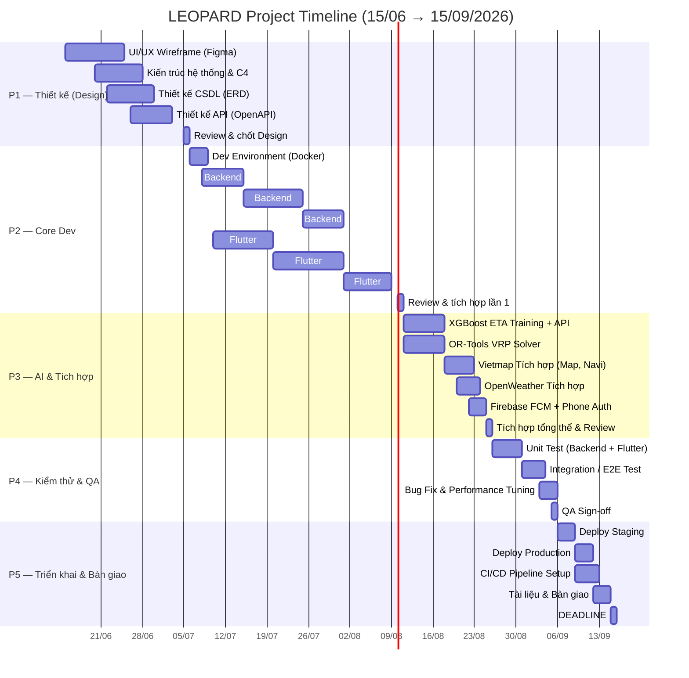
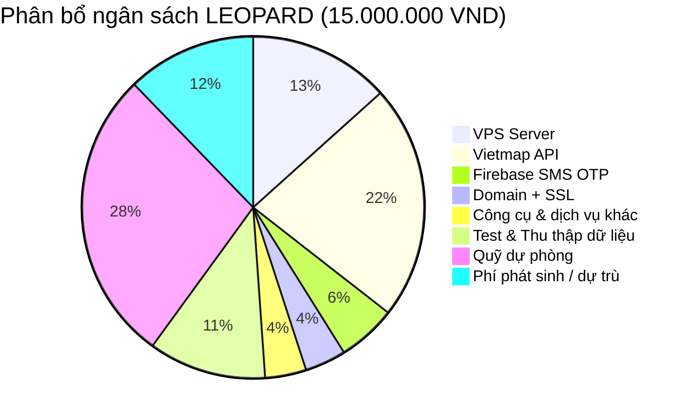

# KẾ HOẠCH DỰ ÁN (PROJECT PLAN)
## LEOPARD — HỆ THỐNG KẾT NỐI VẬN TẢI HÀNG HÓA TRỌNG TẢI LỚN

| Field | Value |
|---|---|
| **Tên tài liệu** | Project Plan |
| **Dự án** | LEOPARD APP |
| **Phiên bản** | 1.0 |
| **Ngày tạo** | 2026-06-15 |
| **Ngày cập nhật** | 2026-06-15 |
| **Ngân sách tối đa** | 15.000.000 VND |
| **Hạn chót** | 15/09/2026 |
| **Tác giả** | PM & Tech Lead Team LEOPARD |

---

## MỤC LỤC

1. [Tổng quan dự án](#1-tổng-quan-dự-án)
2. [Các mốc quan trọng (Milestones)](#2-các-mốc-quan-trọng-milestones)
3. [Phân tích Gantt — Tiến độ chi tiết](#3-phân-tích-gantt--tiến-độ-chi-tiết)
4. [Phân công nhiệm vụ theo giai đoạn](#4-phân-công-nhiệm-vụ-theo-giai-đoạn)
5. [Quản lý rủi ro (Risk Management)](#5-quản-lý-rủi-ro-risk-management)
6. [Ngân sách chi tiết (Budget Breakdown)](#6-ngân-sách-chi-tiết-budget-breakdown)
7. [Kế hoạch dự phòng (Contingency Plan)](#7-kế-hoạch-dự-phòng-contingency-plan)

---

## 1. TỔNG QUAN DỰ ÁN

### 1.1. Thông tin dự án

- **Tên dự án:** LEOPARD — Hệ thống kết nối vận tải hàng hóa trọng tải lớn
- **Mục tiêu:** Xây dựng app demo kết nối chủ hàng (SME, cá nhân) với tài xế xe tải / xe ba gác, tích hợp AI dự báo ETA, định tuyến tránh cấm tải và tối ưu ghép hàng
- **Ngân sách tối đa:** **15.000.000 VND** (không phát sinh thêm)
- **Thời gian:** **15/06/2026 → 15/09/2026** (13 tuần / ~3 tháng)
- **Công nghệ chính:**
  - Frontend: Flutter (Mobile + Web)
  - Backend: FastAPI (Python)
  - Database: PostgreSQL 16 + PostGIS + TimescaleDB + Redis
  - AI: XGBoost (ETA) + Google OR-Tools (VRP)
  - Bản đồ: Vietmap API
  - Thời tiết: OpenWeatherMap API
  - Thông báo: Firebase Cloud Messaging (FCM)
  - Xác thực: Firebase Phone Auth (SMS OTP)

### 1.2. Phạm vi

| Trong phạm vi (In Scope) | Ngoài phạm vi (Out of Scope) |
|---|---|
| App đặt xe tải / xe ba gác (Mobile + Web) | Cổng thanh toán Momo, VNPay (dùng VietQR thay thế) |
| AI dự báo ETA (XGBoost) | Bản đồ Google Maps trả phí (dùng Vietmap + OSRM) |
| Định tuyến tránh cấm tải (Vietmap Navigation) | Ứng dụng native iOS/Android riêng biệt (dùng Flutter đa nền tảng) |
| Dashboard quản lý doanh nghiệp (Flutter Web) | Tính năng real-time chat nâng cao |
| Định tuyến ghép hàng VRP (OR-Tools) | Ứng dụng quản lý kho bãi WMS |
| Theo dõi GPS real-time | Tích hợp IoT / cảm biến xe |
| Thanh toán COD + VietQR | Bảo hiểm hàng hóa |

---

## 2. CÁC MỐC QUAN TRỌNG (MILESTONES)

| # | Milestone | Mô tả | Thời gian dự kiến | Kết quả bàn giao (Deliverable) |
|---|---|---|---|---|
| **P1** | **Hoàn thành Thiết kế** | UI/UX wireframe, kiến trúc hệ thống, cơ sở dữ liệu | 15/06 → 05/07 (3 tuần) | • Wireframe Figma<br>• Kiến trúc hệ thống (C4 diagram)<br>• ERD + Database Schema<br>• API Design (OpenAPI spec) |
| **P2** | **Hoàn thành Core Dev** | Backend API cơ bản + Flutter app core flow | 06/07 → 10/08 (5 tuần) | • Backend Auth, Orders, Users APIs<br>• Flutter app: đăng nhập, đặt đơn, theo dõi<br>• Database migration scripts<br>• Docker Compose dev environment |
| **P3** | **Hoàn thành AI & Tích hợp** | AI ETA, VRP routing, Vietmap, weather | 11/08 → 25/08 (2 tuần) | • XGBoost ETA model (training + inference)<br>• OR-Tools VRP solver<br>• Vietmap navigation + autocomplete<br>• OpenWeather tích hợp |
| **P4** | **Hoàn thành Kiểm thử** | Unit test, Integration test, QA, bug fix | 26/08 → 05/09 (1.5 tuần) | • Test report<br>• Bug tracker closed<br>• Performance benchmark |
| **P5** | **Triển khai & Bàn giao** | Deploy staging/production, handover | 06/09 → 15/09 (1.5 tuần) | • Production server running<br>• CI/CD pipeline<br>• Tài liệu hướng dẫn deploy<br>• Báo cáo quá trình thực hiện |

---

## 3. PHÂN TÍCH GANTT — TIẾN ĐỘ CHI TIẾT



### 3.1. Tổng quan timeline

| Giai đoạn | Thời gian | Tuần | Tỷ lệ % |
|---|---|---|---|
| P1 — Thiết kế | 15/06 → 05/07 | 3 tuần | 23% |
| P2 — Core Dev | 06/07 → 10/08 | 5 tuần | 38% |
| P3 — AI & Tích hợp | 11/08 → 25/08 | 2 tuần | 15% |
| P4 — Kiểm thử & QA | 26/08 → 05/09 | 1.5 tuần | 12% |
| P5 — Triển khai & Bàn giao | 06/09 → 15/09 | 1.5 tuần | 12% |
| **Tổng** | **15/06 → 15/09** | **13 tuần** | **100%** |

---

## 4. PHÂN CÔNG NHIỆM VỤ THEO GIAI ĐOẠN

### Giai đoạn 1: Thiết kế (Design) — 3 tuần

| Task | Người phụ trách | Đầu ra |
|---|---|---|
| Vẽ wireframe tất cả màn hình (Figma) | FE Designer | Wireframe (Mobile + Web) |
| Thiết kế kiến trúc hệ thống (C4 model) | Tech Lead | C4 Context + Container diagrams |
| Thiết kế ERD và Database Schema | Backend Dev | ERD (docs/erd.md) |
| Thiết kế API Endpoints (OpenAPI 3.0) | Backend Dev | OpenAPI spec (YAML/JSON) |
| Review & Approval | PM + Team | Sign-off tài liệu |

### Giai đoạn 2: Phát triển cốt lõi (Core Dev) — 5 tuần

| Task | Người phụ trách | Đầu ra |
|---|---|---|
| Docker Compose + env setup | Backend Dev | Môi trường dev chạy được |
| Module Auth (đăng ký, đăng nhập, OTP) | Backend Dev | API /auth/* |
| Module Users (profile, KYC, giấy tờ) | Backend Dev | API /users/* |
| Module Orders (đặt đơn, đa điểm, tracking) | Backend Dev | API /orders/* |
| Module Payments (COD, VietQR) | Backend Dev | API /payments/* |
| WebSocket tracking real-time | Backend Dev | Socket IO tracking |
| Flutter: Auth screens & Profile UI | FE Dev | Màn hình ĐK/ĐN + Profile |
| Flutter: Order flow (tạo đơn, chọn xe, theo dõi) | FE Dev | Luồng đặt đơn hoàn chỉnh |
| Flutter Web: Dashboard doanh nghiệp | FE Dev | Dashboard quản lý fleet |

### Giai đoạn 3: AI & Tích hợp (AI & Integration) — 2 tuần

| Task | Người phụ trách | Đầu ra |
|---|---|---|
| Thu thập dữ liệu & train XGBoost ETA model | AI Engineer | Model file (.pkl) + API predict |
| Tích hợp Google OR-Tools VRP solver | AI Engineer | API /optimize/route |
| Tích hợp Vietmap (Map SDK, Navigation, Autocomplete) | Fullstack | Bản đồ + dẫn đường tránh cấm tải |
| Tích hợp OpenWeatherMap (thời tiết real-time) | Backend Dev | API /weather/* |
| Firebase Phone Auth (SMS OTP) + FCM | Backend Dev | Xác thực SĐT + Push notification |
| Tích hợp tổng thể AI vào API | AI + Backend | End-to-end ETA + VRP working |

### Giai đoạn 4: Kiểm thử & QA — 1.5 tuần

| Task | Người phụ trách | Đầu ra |
|---|---|---|
| Unit test Backend (Pytest, coverage >80%) | Backend Dev | Test report |
| Unit test Flutter (Widget test) | FE Dev | Test report |
| Integration test (API + Database) | QA | Integration test report |
| E2E test trên thiết bị thật (Android/iOS/Web) | QA | Bug list |
| Performance test (100 concurrent requests) | Backend Dev | Benchmark report |
| Bug fix & retest | Team | All critical bugs closed |

### Giai đoạn 5: Triển khai & Bàn giao — 1.5 tuần

| Task | Người phụ trách | Đầu ra |
|---|---|---|
| Deploy staging (VPS) | Backend Dev | Staging URL |
| Deploy production (VPS) | Backend Dev | Production URL |
| CI/CD (GitHub Actions) | Backend Dev | Auto deploy pipeline |
| Viết tài liệu hướng dẫn deploy | PM | docs/deploy-guide.md |
| Viết báo cáo quá trình thực hiện | PM | Báo cáo hoàn chỉnh |
| Bàn giao source code + tài liệu | PM | GitHub repo + docs |

---

## 5. QUẢN LÝ RỦI RO (RISK MANAGEMENT)

### 5.1. Danh sách rủi ro (Risk Register)

| # | Rủi ro | Xác suất | Tác động | Cấp độ | Kế hoạch ứng phó (Mitigation) | Phương án dự phòng |
|---|---|---|---|---|---|---|
| R01 | **Vietmap free tier hết hạn** (2 tháng) | Cao (80%) | Cao (thiếu bản đồ dẫn đường) | **Cao** | Tối ưu cache tile; giảm số lượng API call; chuyển nhanh qua production trong thời gian free | Fallback sang OSRM self-hosted + OpenStreetMap tile (hoàn toàn miễn phí) |
| R02 | **Firebase SMS OTP vượt quota free** | Trung bình (50%) | Trung bình (không gửi được OTP) | **TB** | Giới hạn số lần gửi OTP/test; dùng tính năng reCAPTCHA để giảm SMS | Chuyển sang email OTP hoặc test mode (disable SMS verify) |
| R03 | **VPS quá tải / downtime** | Thấp (30%) | Cao (app không truy cập được) | **TB** | Chọn VPS có uptime SLA >99.9%; monitor resource | Scale lên gói VPS cao hơn (dùng quỹ dự phòng); backup DB hàng ngày |
| R04 | **XGBoost model accuracy thấp do thiếu dữ liệu** | Cao (70%) | Trung bình (ETA sai lệch) | **TB** | Thu thập dữ liệu mô phỏng; dùng traffic real-time để hiệu chỉnh | Fallback ETA đơn giản (distance/speed) nếu model không đạt yêu cầu |
| R05 | **Nhân sự nghỉ / chậm tiến độ** | Trung bình (40%) | Cao (chậm deadline) | **TB** | Sprint ngắn (1 tuần); daily standup; buffer 1 tuần dự phòng | Giảm scope tính năng không thiết yếu; tập trung MVP |
| R06 | **Flutter Web performance kém** | Trung bình (50%) | Trung bình (UX kém) | **TB** | Tối ưu rendering; dùng canvas-based widgets; lazy loading | Chuyển Dashboard sang React nhẹ hơn nếu cần |
| R07 | **Phát sinh chi phí ngoài dự kiến** | Thấp (30%) | Cao (vượt 15M budget) | **TB** | Tracking chi phí hàng tuần; ưu tiên miễn phí / freemium | Dùng quỹ dự phòng 2.5M (xem Budget) |
| R08 | **Lỗi bảo mật (SQL injection, XSS)** | Thấp (20%) | Rất cao (lộ dữ liệu) | **TB** | ORM (SQLAlchemy) chống SQLi; validate input; CORS; rate limiting | Security review trước khi deploy; penetration test cơ bản |
| R09 | **API Vietmap thay đổi / không ổn định** | Thấp (20%) | Trung bình | **Thấp** | Có fallback OSRM + Nominatim cho geocoding | Chuyển hoàn toàn qua OSRM self-hosted |
| R10 | **Thiết bị Android/iOS test không đầy đủ** | Trung bình (40%) | Thấp (bug trên 1 số thiết bị) | **Thấp** | Dùng Firebase Test Lab (miễn phí) | Test thủ công trên 3-5 thiết bị phổ biến |

### 5.2. Ma trận rủi ro (Risk Matrix)

```
Tác động (Impact)
    Rất cao  |        |        |        |   R08  |
    Cao      |        |  R01   |  R03   |        |
    TB       |        | R02,R04| R05,R06|        |
    Thấp     |  R09   |  R10   |        |        |
             +--------+--------+--------+--------+
              Thấp     TB      Cao     Rất cao
                          Xác suất (Probability)
```

---

## 6. NGÂN SÁCH CHI TIẾT (BUDGET BREAKDOWN)

### 6.1. Tổng quan ngân sách

| Hạng mục | Chi phí (VND) | Ghi chú |
|---|---|---|
| **VPS Server** (4 tháng) | 1.200.000 | ~300.000 VND/tháng (gói starter) |
| **Vietmap API** (2 tháng free + 2 tháng trả phí) | 2.000.000 | Hoặc dùng free 2 tháng + fallback OSRM |
| **Firebase SMS OTP** (Phone Auth) | 500.000 | ~2.000 lượt SMS (0,025 USD/lần) |
| **OpenWeatherMap API** | **0** | Free tier (1.000.000 calls/tháng) |
| **Domain + SSL** | 350.000 | .com.vn (200k) + SSL free (Let's Encrypt) |
| **Firebase Cloud Messaging (FCM)** | **0** | Miễn phí không giới hạn |
| **Công cụ & dịch vụ khác** | 350.000 | Figma (free), GitHub (free), Docker Hub (free) |
| **Chi phí test & thu thập dữ liệu** | 1.000.000 | Mô phỏng dữ liệu, chạy thử nghiệm |
| **Quỹ dự phòng (Contingency)** | 2.500.000 | 16.7% tổng ngân sách |
| **Phí phát sinh / dự trù** | 1.100.000 | Dành cho chi phí không lường trước |
| **Tổng cộng** | **9.000.000** | |
| **Ngân sách còn lại (dư)** | **6.000.000** | Tiết kiệm, có thể dùng mở rộng nếu cần |

### 6.2. Chi tiết từng hạng mục

#### 6.2.1. VPS Server

| Thông số | Giá trị |
|---|---|
| Nhà cung cấp | **Vietnix / VinaHost / Nhân Hòa** |
| CPU | 1 vCPU |
| RAM | 2 GB |
| SSD | 25 GB |
| Bandwidth | 1 TB/tháng |
| Giá | ~300.000 VND/tháng |
| Thời gian | 4 tháng (06/2026 → 09/2026) |
| **Tổng** | **1.200.000 VND** |

> **Giảm chi phí:** Có thể dùng Oracle Cloud Free Tier (VM.Standard.E2.1.Micro — 1 vCPU, 1GB RAM, 10GB SSD) hoàn toàn miễn phí, giảm 1.200.000 VND.

#### 6.2.2. Vietmap API

| Dịch vụ | Chi phí |
|---|---|
| Free Tier (2 tháng đầu: 06-07/2026) | **0 VND** |
| Basic Plan (tháng 08-09/2026) | ~1.000.000 VND/tháng × 2 tháng |
| **Tổng** | **2.000.000 VND** |

> **Giải pháp thay thế tiết kiệm:** Nếu chuyển hoàn toàn sang OSRM (self-hosted) + OpenStreetMap tiles (free), chi phí Vietmap = **0 VND**. OSRM chạy trong Docker trên cùng VPS.

#### 6.2.3. Firebase Authentication (Phone — SMS OTP)

| Thông số | Giá trị |
|---|---|
| Quota miễn phí Firebase Auth | 10.000 xác thực/tháng (Identity Toolkit) |
| Chi phí SMS (qua Twilio hoặc Firebase + đối tác VN) | ~2.500 VND/lần (0,025 USD) |
| Dự kiến số lần gửi SMS trong suốt dự án | ~200 lần (test 50 lần + demo 150 lần) |
| **Tổng** | **500.000 VND** |

> **Lưu ý:** Firebase Authentication không tính phí cho Email/Password sign-in. Chỉ SMS OTP mới có phí. Có thể chuyển phần lớn test qua Email OTP để tiết kiệm.

#### 6.2.4. OpenWeatherMap API

| Thông số | Giá trị |
|---|---|
| Gói | Free Tier (One Call API 3.0) |
| Số lượt gọi | 1.000 calls/ngày (30.000 calls/tháng) |
| **Chi phí** | **0 VND** |

#### 6.2.5. Domain + SSL

| Hạng mục | Chi phí |
|---|---|
| Domain `.com.vn` (1 năm) | ~200.000 VND |
| SSL Certificate (Let's Encrypt) | **Miễn phí** |
| **Tổng** | **350.000 VND** |

> Có thể dùng domain miễn phí (`.nip.io`, `.traefik.me`) hoặc subdomain từ free provider để giảm thêm 200.000 VND.

#### 6.2.6. Dịch vụ miễn phí

| Dịch vụ | Chi phí | Ghi chú |
|---|---|---|
| GitHub (Private repo) | **0 VND** | Free plan đủ dùng |
| Figma (Design) | **0 VND** | Free plan (3 projects) |
| Docker Hub | **0 VND** | Public images |
| Firebase FCM | **0 VND** | Miễn phí không giới hạn |
| Firebase Test Lab | **0 VND** | Free tier cho test |
| Let's Encrypt SSL | **0 VND** | Tự động renew |

#### 6.2.7. Chi phí test & thu thập dữ liệu

| Hạng mục | Chi phí |
|---|---|
| Thuê xe thử nghiệm (2 lần × 200k) | 400.000 VND |
| Mô phỏng dữ liệu GPS tracking | 0 VND (tự gen script) |
| Chi phí đi lại khảo sát | 300.000 VND |
| Dữ liệu train XGBoost (mô phỏng + public datasets) | 300.000 VND |
| **Tổng** | **1.000.000 VND** |

### 6.3. Biểu đồ phân bổ ngân sách



### 6.4. Bảng cân đối ngân sách

```
Tổng ngân sách dự án:        15.000.000 VND
                          ─────────────────
Chi phí đã lên kế hoạch:     9.000.000 VND
Quỹ dự phòng (16.7%):        2.500.000 VND
Phí phát sinh / dự trù:      1.100.000 VND
                          ─────────────────
Tổng chi dự kiến:           12.600.000 VND
Dư (tiết kiệm):              2.400.000 VND
                          ─────────────────
                              ✅ TRONG NGÂN SÁCH
```

### 6.5. Kịch bản tối ưu chi phí (Cost Optimization Scenarios)

| Kịch bản | Tiết kiệm | Cách thực hiện |
|---|---|---|
| **Tối ưu** (khuyến nghị) | 3.550.000 VND | Dùng Oracle Cloud Free Tier VPS thay vì VPS trả phí (tiết kiệm 1.200.000) + OSRM self-hosted thay Vietmap (tiết kiệm 2.000.000) + dùng Email OTP thay SMS (tiết kiệm 350.000) |
| **Tiết kiệm tối đa** | 4.750.000 VND | Tối ưu + dùng domain free (tiết kiệm thêm 200.000) + tận dụng Figma Community (tiết kiệm thêm 350.000) + dùng dữ liệu public hoàn toàn (tiết kiệm 1.000.000) |

---

## 7. KẾ HOẠCH DỰ PHÒNG (CONTINGENCY PLAN)

### 7.1. Lịch trình dự phòng

Trong trường hợp một giai đoạn bị chậm, kế hoạch dự phòng như sau:

| Giai đoạn chậm | Hành động | Ảnh hưởng |
|---|---|---|
| P1 — Thiết kế chậm | Rút ngắn review xuống 1 ngày; giảm số lượng màn hình wireframe | Ít |
| P2 — Core Dev chậm | Ưu tiên tính năng cốt lõi (đặt đơn + tracking); delay dashboard Web | Trung bình |
| P3 — AI chậm | Fallback ETA đơn giản (không AI); defer VRP optimization | Cao |
| P4 — QA chậm | Giảm scope E2E test; test trên 2 thiết bị chính | Trung bình |

### 7.2. Buffer & quỹ thời gian

- **Buffer dự phòng:** 1 tuần (từ 08/09 → 15/09) được tính vào giai đoạn P5
- **Giảm scope (Minimum Viable Product — MVP):** Nếu nguy cơ trễ deadline, chỉ giữ lại:
  1. Đăng ký / Đăng nhập (SĐT/Google)
  2. Đặt đơn nhanh (đơn giản: 1 điểm lấy + 1 điểm giao)
  3. Bản đồ hiển thị (Vietmap / OSRM)
  4. Theo dõi real-time (WebSocket + GPS)
  5. Thanh toán COD + VietQR
  6. Thông báo Firebase (FCM)

### 7.3. Quỹ tài chính dự phòng

- **Quỹ dự phòng:** 2.500.000 VND (16.7% tổng ngân sách)
- **Mục đích sử dụng:** 
  - VPS upgrade nếu cần thêm resource (1.200.000 VND)
  - Vietmap gia hạn thêm tháng (1.000.000 VND)
  - Chi phí SMS OTP phát sinh (500.000 VND)
- **Quy trình giải ngân:** PM phải phê duyệt trước khi sử dụng quỹ dự phòng

---

## PHỤ LỤC

### A. Checklist bàn giao (Handover Checklist)

| Hạng mục | Đạt | Ghi chú |
|---|---|---|
| Source code (GitHub/GitLab) | ☐ | |
| Database migration scripts | ☐ | |
| Docker Compose + .env mẫu | ☐ | |
| Tài liệu hướng dẫn deploy | ☐ | |
| Tài liệu API (OpenAPI) | ☐ | |
| Tài liệu kiến trúc (C4) | ☐ | |
| ERD (docs/erd.md) | ☐ | |
| Project Plan (docs/project-plan.md) | ☐ | |
| Báo cáo quá trình thực hiện | ☐ | |
| Test reports | ☐ | |
| AI model file + training data | ☐ | |
| Tài khoản dịch vụ (Vietmap, Firebase, ...) | ☐ | |

### B. Công cụ & Môi trường

| Công cụ | Mục đích | URL |
|---|---|---|
| GitHub | Quản lý source code | github.com |
| Figma | Thiết kế UI/UX | figma.com |
| Docker | Môi trường dev/prod | docker.com |
| Firebase Console | Auth, FCM, Test Lab | console.firebase.google.com |
| Vietmap Developer | API bản đồ | dev.vietmap.vn |
| OpenWeatherMap | Weather API | openweathermap.org |
| Adminer | Quản trị DB (dev) | Docker container |
| Let's Encrypt | SSL miễn phí | letsencrypt.org |

### C. Lịch họp & Báo cáo định kỳ

| Loại họp | Tần suất | Tham dự | Nội dung |
|---|---|---|---|
| Daily Standup | Hàng ngày (15 phút) | Toàn team | Cập nhật tiến độ, blockers |
| Sprint Planning | Đầu mỗi tuần (30 phút) | Toàn team | Lên kế hoạch tuần mới |
| Sprint Review | Cuối mỗi tuần (30 phút) | Toàn team | Demo kết quả, review |
| Weekly PM Report | Mỗi thứ 2 | PM → Stakeholder | Báo cáo tiến độ + budget |

---

> **Tài liệu tham khảo:**
> - [SRS — Software Requirements Specification](srs.md)
> - [ERD — Database Design](erd.md)
> - [ADR-001: Frontend Technology Selection](adr/adr-001-frontend-technology-selection.md)
> - [ADR-002: Backend Technology Selection](adr/adr-002-backend-technology-selection.md)
> - [ADR-003: GIS & Routing Engine](adr/adr-003-gis-and-routing-engine.md)
> - [ADR-004: Database Architecture](adr/adr-004-database-architecture.md)
> - [ADR-005: AI ETA & Optimization Architecture](adr/adr-005-ai-eta-and-optimization-architecture.md)
> - [PRD — Product Requirements Document](../LEOPARD%20-%20K%E1%BA%BET%20N%E1%BB%90I%20V%E1%BA%ACN%20T%E1%BA%A2I%20H%C3%80NG%20H%C3%93A%20TR%E1%BB%8CNG%20T%E1%BA%A2I%20L%E1%BB%9AN.md)
